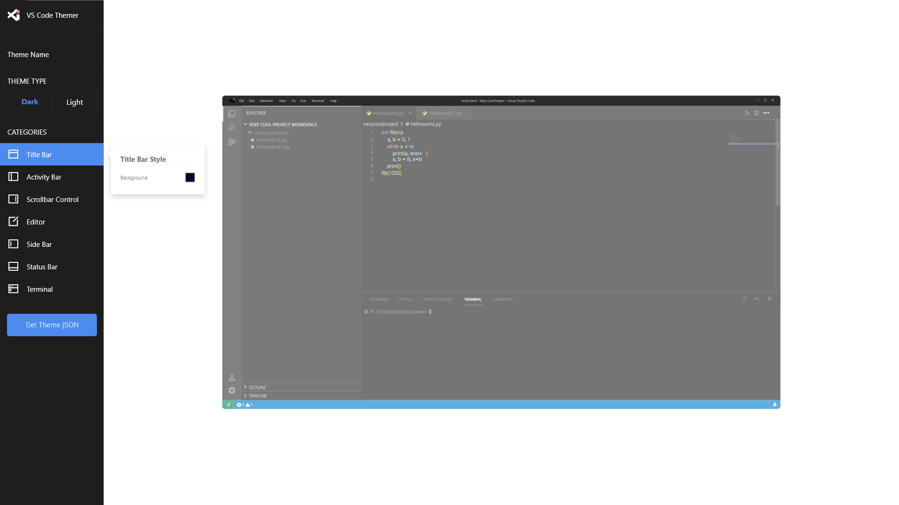
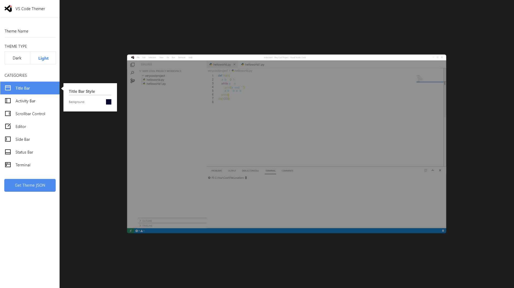

# Visual Studio Code Dynamic Themer

### A dynamic themer for those that what to test color combinations for the Visual Studio Code Text Editor

## Features

- Live color display for every component of VS Code Text Editor
- Light and Dark modes for different color profiles
- JSON output to create a VS Code theme 
- Step by step guide to create VS Code themer

## Screenshots

Dark Mode Dashboard

Light Mode Dashboard

## Future Todo 

| Description                                                          | Progress                                                           |
|----------------------------------------------------------------------|--------------------------------------------------------------------|
| Color implementation for all components on VS Code  |                  |
| Color change on user changes |                  |
| Work text color contrast based on background color |                  |
| Break up layout elements into react components  |                  |

| JSON output for creating VS Code theme                                                         |  |
| Step by step guide to create and add VS Code themes                         |  |

Done

| Description                                     | Progress                                                       |
|-------------------------------------------------|----------------------------------------------------------------|
| Logo design                     |  |
| Application design wireframes |  |
| VS Code Theme build research |  |
| VS Code layout cloned |  |
| Porting HTML, CSS & JS build to ReactJS for better development |  |

